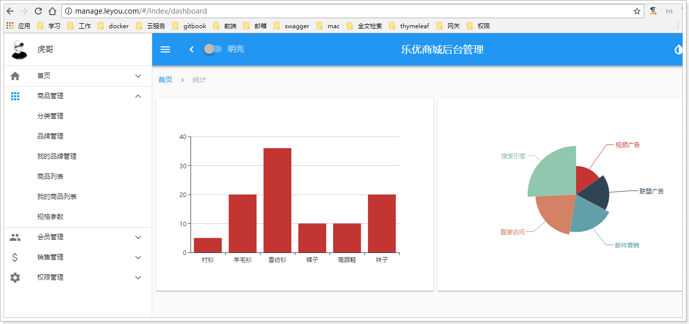

# 微服务商城项目 Readme

[](https://github.com/KaidongShen/Leyou)
[](http://www.itheima.com/)
[](https://www.boxuegu.com/)

微服务商城项目介绍

微服务商城项目. 本项目来自bilibili黑马程序员网络免费资源, 乐优商城虎哥MAC版, 中间需要使用虚拟机. 更多资料请访问黑马程序员官方主页和博学谷. 本人通过网上的教程, 学习微服务系统中, 所用到的如Springboot, SpringCloud, Redis, Elasticsearch, Nginx等技术.

本仓库包含以下内容：

1. leyou后端微服务全项目-[乐优后端](spec.md)。
2. leyou-manage-web后台管理前端项目-[乐优管理前端](https://github.com/KaidongShen/Leyou/tree/master/leyou-manage-web)。
3. leyou-portal门户网站-[乐优门户网站](https://github.com/KaidongShen/Leyou/tree/master/leyou-portal)。
4. es-demo-[Elasticsearch-demo](https://github.com/KaidongShen/Leyou/tree/master/es-demo)。
5. itcast-rabbitmq-[rabbitmq-demo](https://github.com/KaidongShen/Leyou/tree/master/itcast-rabbitmq)。
6. redis-demo-[redis-demo](https://github.com/KaidongShen/Leyou/tree/master/redis-demo)。
6. dysms-demo-[alibabacloud-dysms-demo](https://github.com/KaidongShen/Leyou/tree/master/dysms-demo)。


## 内容列表

- [背景](#背景)
- [安装](#安装)
- [使用说明](#使用说明)
	- [生成器](#生成器)
- [徽章](#徽章)
- [示例](#示例)
- [相关仓库](#相关仓库)
- [维护者](#维护者)
- [如何贡献](#如何贡献)
- [使用许可](#使用许可)

## 背景


`乐优商城` 最开始是从B站上看到的一个微服务项目. 网上资料很多, 所以开始着手学习. 但是在学习中发现非常多的不便. 首先网上版本众多, 有的版本需要用到虚拟机, 有的版本只用windows系统. 并且笔记和视频不配套. 比如在写商品详情页的时候. 碰到了很多意想不到的问题. 商品详情页的前端代码与视频中差别很大, 网上能找到的版本中还有报错. 各种软件都需要自己部署在Linux系统中, 比如在安装Redis的时候, 由于CentOS6.4已经停止维护, 镜像文件不能使用, 需要CentOS6.4中的镜像地址. Elasticsearch在安装中, 需要更新CentOS中的Java版本等问题.

即便有诸多问题, 但是我还是受益颇多. 这是我第一个微服务项目, 我会在这个目录下, 补充完整我的代码, 以及在项目中添加注释. 未来还会补充关于此项目的笔记以及我自己对这个项目的一些看法.

> 如果你的文档是完整的，那么使用你代码的人就不用再去看代码了。这非常的重要。它使得你可以分离接口文档与具体实现。它意味着你可修改实现的代码而保持接口与文档不变。

> 请记住：是文档而非代码，定义了一个模块的功能。

—— [Ken Williams, Perl Hackers](http://mathforum.org/ken/perl_modules.html#document)

写 README 从某种程度上来说相当不易，一直维护下去更是难能可贵。如果可以减少这个过程，则可以让写代码与修改代码更容易，使得是否在说明中指明一处需改有无必要更加清楚，你可以花费更少的时间来考虑是否你最初的文档是否需要更新，你可以分配更多的时间来写代码而非维护文档。

同时，标准化在某些别的地方也有好处。有了标准化，用户就可以花费更少的时间来搜索他们需要的信息，他们同时可以做一个工具来从描述中搜集信息，自动跑示例代码，检查授权协议等等。

这个仓库的目标是：

1. 一个定义良好的**规范**。在仓库中的位置是 [spec.md](spec.md)。它是一个一直在持续优化的文档，欢迎您提 Issue 讨论其中的变化。
2. 一个**示例 README**。这个 Readme 完全遵从 Standard-readme，而且在 `example-readmes` 文件夹里有更多的示例。
3. 一个**语法提示器**用来提示在 Readme 中的语法错误。请参考 [tracking issue](https://github.com/RichardLitt/standard-readme/issues/5)。
4. 一个**生成器**用来快速搭建新的 README 的框架。请参考 [generator-standard-readme](https://github.com/RichardLitt/generator-standard-readme)。
5. 一个**标识准守规范的徽章**。请参考[徽章](#徽章)。

## 安装

这个项目使用 [node](http://nodejs.org) 和 [npm](https://npmjs.com)。请确保你本地安装了它们。

```sh
$ npm install --global standard-readme-spec
```

## 使用说明

这只是一个文档包，你可以打印出 [spec.md](spec.md) 到输出窗口。

```sh
$ standard-readme-spec
# Prints out the standard-readme spec
```

### 生成器

想要使用生成器的话，请看 [generator-standard-readme](https://github.com/RichardLitt/generator-standard-readme)。
有一个全局的可执行文件来运行包里的生成器，生成器的别名叫 `standard-readme`。

## 徽章
如果你的项目遵循 Standard-Readme 而且项目位于 Github 上，非常希望你能把这个徽章加入你的项目。它可以更多的人访问到这个项目，而且采纳 Stand-README。 加入徽章**并非强制的**。 

[](https://github.com/RichardLitt/standard-readme)

为了加入徽章到 Markdown 文本里面，可以使用以下代码：

```
[](https://github.com/RichardLitt/standard-readme)
```

## 示例

想了解我们建议的规范是如何被应用的，请参考 [example-readmes](example-readmes/)。

# 1.乐优商城介绍

## 1.1.项目介绍

- 乐优商城是一个全品类的电商购物网站（B2C）。
- 用户可以在线购买商品、加入购物车、下单、秒杀商品
- 可以品论已购买商品
- 管理员可以在后台管理商品的上下架、促销活动
- 管理员可以监控商品销售状况
- 客服可以在后台处理退款操作
- 希望未来3到5年可以支持千万用户的使用


## 1.2.系统架构

### 1.2.1.架构图

乐优商城架构缩略图，大图请参考课前资料：

DevOps


nginx的负载均衡

CDN

### 1.2.2.系统架构解读

整个乐优商城可以分为两部分：后台管理系统、前台门户系统。

- 后台管理：

  - 后台系统主要包含以下功能：
    - 商品管理，包括商品分类、品牌、商品规格等信息的管理
    - 销售管理，包括订单统计、订单退款处理、促销活动生成等
    - 用户管理，包括用户控制、冻结、解锁等
    - 权限管理，整个网站的权限控制，采用JWT鉴权方案，对用户及API进行权限控制
    - 统计，各种数据的统计分析展示
  - 后台系统会采用前后端分离开发，而且整个后台管理系统会使用Vue.js框架搭建出单页应用（SPA）。
  - 预览图：

  

- 前台门户

  - 前台门户面向的是客户，包含与客户交互的一切功能。例如：
    - 搜索商品
    - 加入购物车
    - 下单
    - 评价商品等等
  - 前台系统我们会使用Nuxt结合Vue完成页面开发。出于SEO优化的考虑，我们将不采用单页应用。

  


无论是前台还是后台系统，都共享相同的微服务集群，包括：

- 商品微服务：商品及商品分类、品牌、库存等的服务
- 搜索微服务：实现搜索功能
- 订单微服务：实现订单相关
- 购物车微服务：实现购物车相关功能
- 用户中心：用户的登录注册等功能
- 认证中心：用户权限及服务权限认证
- Eureka注册中心
- Zuul网关服务
- Spring Cloud Config配置中心
- ...


## 1.3.技术选型

### 1.3.1.相关技术

前端技术：

- 基础的HTML、CSS、JavaScript（基于ES6标准）
- Vue.js 2.0以及基于Vue的UI框架：Vuetify
- 前端构建工具：WebPack
- 前端安装包工具：NPM
- Vue脚手架：Vue-cli
- Vue路由：vue-router
- ajax框架：axios
- 基于Vue的富文本框架：quill-editor

后端技术：

- 基础的SpringMVC、Spring 5.0和MyBatis3
- Spring Boot 2.0.1版本
- Spring Cloud 最新版 Finchley.RC1
- Redis-4.0
- RabbitMQ-3.4
- Elasticsearch-5.6.8
- nginx-1.10.2
- FastDFS - 5.0.8
- MyCat
- Thymeleaf
- JWT


### 1.3.2.技术解读

上面的技术组合可以在项目中解决以下电商中的典型问题：

- 利用Node.js及Vue.js技术栈，实现前后端分离开发

- 利用SpringCloud技术栈，实现真正的微服务实战开发，并且是基于SpringBoot2.0和SpringCloud最新版本Finchley.RC1实现，业内领先。

- 贴近真实的电商数据库设计，解决全品类电商的SPU和SKU管理问题

- 基于FastDFS解决大数据量的分布式文件存储问题

- 基于Elasticsearch高级聚合功能，实现商品的智能过滤搜索

- 基于Elasticsearch高级聚合功能，实现销售业务的复杂统计及报表输出

- 基于LocalStorage实现离线客户端购物车，减轻服务端压力。

- 基于JWT技术及RSA非对称加密实现真正无状态的单点登录。

- 结合JWT和RSA非对称加密，自定义Feign过滤器实现自动化服务间鉴权，解决服务对外暴露的安全问题

- 基于阿里大于实现SMS功能，解决电商短信通知问题

- 基于RabbitMQ实现可靠消息服务，解决服务间通信问题

- 基于RabbitMQ实现可靠消息服务，解决分布式事务问题

- 使用微信SDK实现微信扫码支付，符合主流付款方式

- 基于Redis搭建高可用集群，实现可靠缓存服务即热点数据保存。

  redis持久化，集群，哨兵，主从，缓存击穿，热点key。

- 基于Redis和Mq来应对高可用高并发的秒杀场景

- 基于MyCat实现数据库的读写分离和分库分表

  发视频

- 基于Thymeleaf实现页面模板和静态化，提高页面响应速度和并发能力

- 基于Nginx实现初步的请求负载均衡和请求限流


 

# 2.有关面试

## 2.1、 自我介绍

简短，自然，突出要点。

- 个人信息
  -  简短，快速过。没人在意你叫什么，你老家是哪里的。
- 项目经验
  - 工作时长
  - 突出重点的项目，电商项目。简短描述即可，主要说下项目中的技术架构，亮点

 

## 1.2.你们项目的架构是怎样的？

我们整个项目采用的是前后端分离开发模式。

- 前端分为两部分：

  - 后台管理：主要面向的是数据管理人员，采用基于Vue的单页应用开发方式
  - 门户系统：面向的是客户，门户采用的是Vue结合Nuxt实现服务端渲染方式

- 后端

  后端采用基于SpringCloud的微服务架构，统一对外提供Rest风格接口，无论是后台管理还是门户系统都共享这些微服务接口，而微服务中通过JWT方式来识别用户身份，开放不同接口。

  到这里先不说了。如果继续追问微服务拆分粒度或者SpringCloud细节，再接着回答我们的服务拆分。

 

 

## 1.3、 公司的性质是什么？

外包（注意：最好说是外包公司，否则下面很多问题不好回答）

 

## 1.4、 你们开发的项目上线了吗？

上线了


## 1.5、 你们的项目能访问吗？域名是多少？

由于是外包项目、项目卖给谁都不知道、域名也不知道

 

 

## 1.6、 你们的项目卖了多少钱？

本人只是开发人员、并没有看到公司的合同、不知道卖了多少钱

 

## 1.7、 你们生产环境的服务器有多少台？

计划是20多台。具体不清楚，因为是外包

devops


32核 128G内存


整个微服务部署在docker环境下。

给客户计划是这样的：初期，除了nginx和Eureka及Zuul以外，其它服务基本都是单节点运行，大概有20左右台服务器，如果后续压力过大， 可以继续增加某些服务的节点备份。


计划的服务节点数量：

- nginx：1主，1备

- Eureka集群：2台
- Zuul集群：2台
- 配置中心（ConfigServer）：1台
- RabbitMQ：2台
- Redis：3台
- FastDFS：2台tracker，2台storage
- mysql数据库：1主，1备，2从
- elasticsearch：3台

- 商品服务：1台
- 文件上传服务：1台
- SMS服务：2台
- 搜索服务：2台
- 静态页服务：1台
- 用户中心：1
- 授权中心：2
- 购物车：1
- 订单：2

共计36个服务节点。

 

## 1.8、 你在项目中主要负责什么

我所在的小组主要负责后台系统的开发， 我主要做的是商品管理模块，不过也参与过一些 搜索系统、购物车系统的部分功能。

 

## 1.9、 你们团队有多少人？

四十多人。 

后端：不到30人吧，测试：5人，前端：5人，运维：3人，产品经理3人，项目经理：1人

后端团队又分为5组，每组负责一部分服务。

## 相关仓库

- [黑马程序员](https://github.com/itheima1) — 💌 黑马程序员github。
- [乐优商城项目后台](https://github.com/lyj8330328/leyou) — 乐优商城项目后台-一个非常齐全的版本, 但与本版本有些许不同。
- [乐优商城项目后台与技术解读](https://github.com/Yirito/leyou) — 乐优商城项目技术解读-另一个非常齐全的版本, 但与本版本有些许不同。
- [乐优商城项目笔记](https://shidongxu0312.github.io/2019/11/20/%E4%B9%90%E4%BC%98%E5%95%86%E5%9F%8E%E9%A1%B9%E7%9B%AE/) — 乐优商城项目笔记-一个非常齐全的版本,但与本版本有些许不同。

## 维护者

[@Kaidong Shen](https://github.com/KaidongShen)。

## 如何贡献

非常欢迎你的加入！[提一个 Issue](https://github.com/KaidongShen/Leyou/issues/new) 或者提交一个 Pull Request。

遵循 [Contributor Covenant](http://contributor-covenant.org/version/1/3/0/) 行为规范。

### 贡献者

感谢以下参与项目的人：
[@Kaidong Shen](https://github.com/KaidongShen)。


## 使用许可

[KS](LICENSE) © Kaidong Shen
